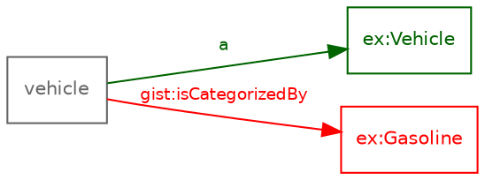

# Modelling-pattern consistency across ontology, taxonomy, transformation, and output data

## Quick start

Run just this feature's test suite (fast -- no `oxi-gen` binary or network
required, a few hundred milliseconds):

```
uv run pytest tests/test_pattern_consistency.py -v
```

Run the checker itself against the worked example in this repo
(`examples/pattern_consistency/`, walked through in full below), either as
its own `ontology-quality-suite` subcommand:

```
uv run ontology-quality-suite pattern-consistency \
  --queries  examples/pattern_consistency/transform.rq \
  --ontology examples/pattern_consistency/ontology.ttl \
  --taxonomy examples/pattern_consistency/taxonomy.ttl \
  --out-dir out/pattern-consistency
```

or the standalone module directly (same checks, same flags minus
`--out-dir`, prints to stdout only):

```
uv run python -m ontology_suite.pattern_consistency \
  --queries  examples/pattern_consistency/transform.rq \
  --ontology examples/pattern_consistency/ontology.ttl \
  --taxonomy examples/pattern_consistency/taxonomy.ttl
```

That one's deliberately broken and should print one finding. Swap in
`transform-fixed.rq` for the clean version:

```
uv run ontology-quality-suite pattern-consistency \
  --queries  examples/pattern_consistency/transform-fixed.rq \
  --ontology examples/pattern_consistency/ontology.ttl \
  --taxonomy examples/pattern_consistency/taxonomy.ttl \
  --out-dir out/pattern-consistency
```

Point `--queries`/`--ontology`/`--taxonomy` at your own files the same way
to run it for real; `--ontology`/`--taxonomy` are repeatable if your setup
spans more than one file each. Add `--fail-on-mismatch` to get a non-zero
exit code for CI use instead of report-only (default) behavior.

**Not the same check as the `consistency` subcommand.** `consistency`
checks ontology<->transformation (prefix/namespace drift, undeclared
classes/properties via `sketch.prefix_alignment`) and, given `--old`,
ontology-version drift -- it has no notion of a taxonomy at all, so it
reports clean on a query that hard-codes a nonexistent taxonomy reference
(exactly `examples/pattern_consistency/transform.rq`'s deliberate flaw).
Running `ontology-quality-suite consistency --new .../ontology.ttl
--queries .../transform.rq` against this same worked example demonstrates
that directly: a clean, correctly-scoped result for the boundary it
actually checks, with no signal that `pattern-consistency`'s
taxonomy<->transformation boundary was never run. If your setup has a
taxonomy layer at all, run both.

The standalone module also runs without `uv` (e.g. inside an
already-activated venv) as plain
`python -m ontology_suite.pattern_consistency ...` /
`pytest tests/test_pattern_consistency.py -v`.

## The four layers

The same modelling decision has to be repeated correctly in four different
places, and nothing forces them to stay in step:

1. **Ontology** -- the OWL2 TBox: classes, properties, axioms.
2. **Taxonomy** -- the controlled vocabulary of *values* data actually
   uses, built *on* the ontology: SKOS concepts, or `gist:Category`
   individuals reached via `gist:isCategorizedBy` (see `docs/UPDATING.md`
   SS2.2 for the taxonomy-as-a-layer framing this tool follows).
3. **Transformation** -- a TARQL/oxi-gen CONSTRUCT query mapping source
   columns to RDF.
4. **Triple output** -- what a transformation actually produces when run
   against real data.

A drift at any one boundary between these four is a real bug long before
it shows up as bad data -- and, importantly, it's usually *invisible* at
the layer where it originates. A query that references a taxonomy value
that doesn't exist runs without error and produces clean-looking Turtle;
nothing about it looks wrong until someone notices the data itself is off.
`ontology_suite.pattern_consistency` exists to catch that kind of drift at
its source, by checking each layer boundary independently:

| Boundary | Checked by | What it catches |
|---|---|---|
| ontology <-> transformation | `sketch.prefix_alignment` | prefix/namespace drift; classes/properties a query uses that the ontology never declares |
| ontology <-> taxonomy | `dataquality.data_quality` (reused) | a taxonomy individual typed with a class the ontology never declared |
| taxonomy <-> transformation | `pattern_consistency.check_taxonomy_references` | a query hard-codes a reference to a controlled-vocabulary individual that doesn't actually exist in the taxonomy -- static, query-text-only |
| ontology+taxonomy <-> output data | `dataquality.data_quality` (reused) | real triplified output using an undeclared class/property, or the wrong type -- *type*-conformance only |
| taxonomy <-> output data | `pattern_consistency.check_taxonomy_membership` | a real triplified value referencing a taxonomy individual that doesn't exist -- *identity* checking, catching exactly what the previous two rows structurally can't (see below) |

Most of these boundaries were already covered by existing tooling
(`docs/TARQL_ALIGNMENT.md`, `dataquality.data_quality`); taxonomy<->
transformation and taxonomy<->output-data are what this module adds.

## Why taxonomy<->transformation needed its own check

It's tempting to assume reviewing real output data (the fourth boundary)
is enough -- if the output's fine, everything upstream must have been
fine too. It isn't: `check_conformance()`'s range checking only flags a
value as wrong if it finds *some other* type for it that doesn't match;
if an IRI has *no* type information at all in the graph being checked, it
comes back "unverifiable", not "wrong" -- deliberately, so a value legitimately
typed in a file that just wasn't included in a given run isn't misreported
as broken. A reference to an individual that **doesn't exist anywhere**
looks identical to that case: no type information at all. So a plausible
but nonexistent taxonomy reference (a typo, or a stale term after a
taxonomy rename) sails straight through output-data review unreported.
Catching it needs a different question -- not "is this value's type
compatible?" but "does this value exist at all?" -- asked directly against
the taxonomy, which is exactly what `check_taxonomy_references` does. The
worked example below demonstrates this concretely.

## The gap `check_taxonomy_references` itself can't cover: dynamically-built values

`check_taxonomy_references` inspects the CONSTRUCT template's own text --
it works because a hard-coded reference (`gist:isCategorizedBy
ex:Gasoline`, written directly by the query author) is a literal IRI
sitting right there to check. It has a structural blind spot: a value
built *dynamically*, one per CSV row --
`BIND(IRI(CONCAT(".../department/", ?department)) AS ?dept)` -- has no
fixed literal in the query text at all. The row-to-row value only exists
once the query actually runs against real data, so no amount of reading
the query text can find a bad one. This is a real, reproducible gap found
building an external SemOps worked example against this suite (a
`department` CSV column with a value -- `"MKT"` -- the taxonomy never
declared, referenced via exactly this per-row `BIND`/`CONCAT` pattern).

`check_taxonomy_membership` covers it, by asking the question at the only
point it can actually be answered -- against real triplified output, not
the query template:

```python
from ontology_suite import pattern_consistency as pc

findings = pc.check_taxonomy_membership(
    ["path/to/real-output.ttl"], ["path/to/ontology.ttl"], ["path/to/taxonomy.ttl"],
)
```

For each property known to point at a taxonomy concept, it collects every
distinct value actually used with that property in the data and reports
any not present as an individual anywhere in the taxonomy graph -- a much
simpler question than type-conformance checking (set membership, not
domain/range/ancestor-walking), and one type-conformance checking
structurally can't answer: an IRI with no `rdf:type` triple anywhere in
the graph being checked is "unverifiable" there (deliberately -- so a
value legitimately typed in a file that just wasn't included in a given
run isn't misreported as broken), and a reference to something that
**genuinely doesn't exist** looks identical to that case. "Does this value
exist at all?" is a different question than "is this value's type
compatible?", and needs asking directly.

**Which property counts as "taxonomy-bound" is inferred automatically** in
the common case, from the property's own declared `rdfs:range`: if that
range class (or a subclass of it -- see below) is actually populated with
individuals in the given taxonomy set, the property is taken as
taxonomy-bound to it. No configuration needed for a property like
`acme:worksIn` (`rdfs:range acme:Department`, with `taxonomy.ttl`
declaring `acme:ENG a acme:Department`) or this suite's own
`gist:isCategorizedBy` (`rdfs:range gist:Category`, with `taxonomy.ttl`
declaring its individuals typed `ex:FuelType`, a `rdfs:subClassOf
gist:Category` -- the inference walks the ontology's own subclass
hierarchy, not just an exact class match, since a taxonomy commonly has a
generic "category root" range class with real individuals typed one of
its more specific subclasses). Pass `property_to_taxonomy_class`
explicitly for a property whose range isn't declared, or isn't itself
close to the taxonomy's root class.

Wired into `pattern-consistency --output-data`/`check_four_layer_consistency`
automatically -- `report.taxonomy_output_data` is populated alongside
`report.output_data` whenever `--output-data`/`output_data_paths` is
given, no separate flag needed.

## Worked example: `examples/pattern_consistency/`

- `ontology.ttl` -- declares `ex:Vehicle` and `ex:FuelType` (a
  `gist:Category` subclass). `gist:Category`/`gist:isCategorizedBy` are
  stubbed locally rather than pulled in via `owl:imports`, purely to keep
  this example small and fast -- a real project would import `gistCore`
  instead.
- `taxonomy.ttl` -- the controlled `ex:FuelType` values: `ex:Petrol`,
  `ex:Diesel`, `ex:Electric`.
- `transform.rq` -- **deliberately broken**: constructs
  `gist:isCategorizedBy ex:Gasoline`, but `ex:Gasoline` was never declared
  in `taxonomy.ttl` (the taxonomy uses `ex:Petrol`) -- a stale term or a
  typo, the kind of thing that's easy to introduce and easy to miss.
- `transform-fixed.rq` -- the fix: `gist:isCategorizedBy ex:Petrol`.
- `vehicles.csv` -- two rows, for triplifying either version through real
  `oxi-gen` to see the drift reach genuine output data.

### Running it

```
$ python -m ontology_suite.pattern_consistency \
    --queries examples/pattern_consistency/transform.rq \
    --ontology examples/pattern_consistency/ontology.ttl \
    --taxonomy examples/pattern_consistency/taxonomy.ttl

== taxonomy <-> transformation ==
  [undeclared_taxonomy_reference] https://example.org/vehicle-demo/Gasoline is used as the value of https://w3id.org/semanticarts/ns/ontology/gist/isCategorizedBy in the TARQL query sketch but is not declared as an individual anywhere in the given taxonomy set.
```

Point it at `transform-fixed.rq` instead and every layer comes back clean:

```
$ python -m ontology_suite.pattern_consistency \
    --queries examples/pattern_consistency/transform-fixed.rq \
    --ontology examples/pattern_consistency/ontology.ttl \
    --taxonomy examples/pattern_consistency/taxonomy.ttl

No modelling-pattern inconsistencies found across ontology, taxonomy, transformation, or output data.
```

Add `--output-data` to also review real triplified output (build it first
with `oxi-gen`, the same way `ontology-quality-suite triplify` does -- see
`docs/TARQL_ALIGNMENT.md`'s "Reviewing real output data" section for the
Python snippet). Running the **broken** transform's real output through
`--output-data` demonstrates the point made above: that layer alone stays
clean even though the output genuinely contains `ex:Gasoline` twice --
`tests/test_pattern_consistency.py::test_broken_transform_output_data_layer_alone_does_not_catch_the_gap`
is a complete, runnable version of this.

### Visualising a gap: `.dot` files

A text finding list is precise but doesn't show *where* in the transform's
shape a gap sits relative to everything else it builds. `--dot` renders the
same transform as a Graphviz digraph, coloured with the identical findings
the text report uses -- so the two are always describing the same thing,
never two independently-computed pictures of "what's wrong" that could
quietly disagree:

```
$ python -m ontology_suite.pattern_consistency \
    --queries examples/pattern_consistency/transform.rq \
    --ontology examples/pattern_consistency/ontology.ttl \
    --taxonomy examples/pattern_consistency/taxonomy.ttl \
    --dot out.dot

== taxonomy <-> transformation ==
  [undeclared_taxonomy_reference] https://example.org/vehicle-demo/Gasoline is used as the value of https://w3id.org/semanticarts/ns/ontology/gist/isCategorizedBy in the TARQL query sketch but is not declared as an individual anywhere in the given taxonomy set.
Wrote out.dot
```

`out.dot` (rendered with `dot -Tsvg out.dot -o out.svg`, or pasted into any
DOT viewer -- including the
[turtle-editor-viewer](https://semantechs.co.uk/turtle-editor-viewer-new/)
companion tool mentioned in the README):



Renders as: the constructed `vehicle` entity, a green `a -> ex:Vehicle`
edge (a declared class -- fine), and a red `gist:isCategorizedBy ->
ex:Gasoline` edge (the gap) sitting right next to it -- immediately
legible even without reading the text finding first. Colour carries
**consistency status**:

| Colour | Meaning |
|---|---|
| red | a known gap -- an undeclared class/property, or a taxonomy reference that doesn't exist |
| dark green | confirmed to resolve against the given ontology/taxonomy declarations |
| gray | a per-row constructed entity -- data the checks don't have an opinion on either way (not "wrong", just unverified) |

Literal *values* are deliberately left out of this red/green/gray
classification entirely -- consistency status was never a meaningful
thing to say about a literal (only classes/properties/taxonomy-references
are ever checked) -- so they fall through to `sketch.dot_export`'s own
per-term-kind default instead of always landing on gray.

Shape/border is a *second*, independent channel carrying **RDF term
kind**, so it never collides with the status colour above: literals
render as ellipses with a **blue border** (text stays the default black,
matching `turtle-editor-viewer`'s own literal convention -- word-wrapped
across multiple lines past 40 characters using Graphviz's own `\l`
left-justified line-break syntax, so one long literal doesn't balloon its
box across the whole picture), blank nodes as small unlabelled **amber**
points (no raw `_:id` shown -- a blank node is a joint connecting real
content, not an entity worth naming, and its id isn't stable across
parses anyway), everything else (IRIs) as boxes in the plain default
colour. An `rdf:first`/`rdf:rest` list chain (`owl:unionOf`/
`intersectionOf`/`disjointWith`) compacts into one amber, rounded-corner
record-shaped node with a port per member instead of one point-and-two-
edges per cell (a list cell *is* a blank node, so it gets the same amber
as the plain-point case -- a list/blank-node construct reads as visually
distinct from a modelled entity, though any of this can still be
recoloured via `node_colors` if a specific node is itself flagged) -- see
`docs/CLASS_DIAGRAMS.md`'s "What a diagram shows" for the full rationale
and a worked example; a pattern-consistency sketch rarely contains a
list, but the rendering is shared code so it applies here too. `rdf:type`
itself always renders as the familiar `a`, not an opaque auto-minted
qname (CONSTRUCT templates write Turtle's `a` shorthand, never the curie
`rdf:type`, so a sketch file never actually declares an `rdf:` prefix for
`graph.qname()` to use).

Only the two *term-level* checks (undeclared classes/properties,
undeclared taxonomy references) show up on this picture -- a
`namespace_mismatch` finding is about a query's `PREFIX` declaration, not
about a specific triple, so it has no natural place here; the text report
still covers it. `sketch.dot_export.graph_to_dot` is the general-purpose
renderer underneath (`edge_colors`/`node_colors` overrides, works with any
rdflib graph, not just a sketch) if you want to render something else with
the same red/green/gray convention.

`sketch.dot_export` borrows its blank-node/literal handling from
[`turtle-editor-viewer`](https://semantechs.co.uk/turtle-editor-viewer-new/)'s
own `graph-generator.ts` -- this suite's other DOT-generating companion
tool -- adapted so shape/style (not colour) carries term-kind, since colour
here already means something (consistency status) that tool doesn't have.
Porting it caught one real bug worth knowing about if you touch this code:
word-wrapping a literal inserts Graphviz's `\l` line-break marker into the
label *before* the generic quote-escaping step runs, and escaping
backslashes there (the natural-looking thing to do) turns `\l` into
literal `\\l` text instead of a line break -- confirmed by actually
rendering one through `dot` and seeing it fail before fixing it
(`tests/test_dot_export.py::test_long_literal_is_word_wrapped_with_real_graphviz_linebreaks`
is the regression test). `_escape()` only escapes quotes now, matching
`graph-generator.ts`'s own minimal `escapeDot()`.

### Python API

```python
from ontology_suite import pattern_consistency as pc

report = pc.check_four_layer_consistency(
    ["path/to/transform.rq"],
    ["path/to/ontology.ttl"],
    ["path/to/taxonomy.ttl"],
    output_data_paths=["path/to/real-output.ttl"],  # optional
)
if not report.is_clean:
    print(pc.format_four_layer_report(report))

# .dot output, same findings, same colours as the CLI's --dot:
pc.write_consistency_dot(
    ["path/to/transform.rq"], ["path/to/ontology.ttl"], ["path/to/taxonomy.ttl"],
    "out.dot",
)
```

`report.ontology_transform` (a `sketch.prefix_alignment.AlignmentReport`),
`report.ontology_taxonomy` (`ResultRow`s, `CNF-001`/`CNF-002`/`CNF-003`/
`CNF-004`), `report.taxonomy_transform` (`TaxonomyReferenceGap`s),
`report.output_data`, and `report.taxonomy_output_data`
(`TaxonomyReferenceGap`s again -- `None` unless `output_data_paths` was
given) are also inspectable individually. The `ResultRow`-producing checks
omit `CNF-005` ("class never populated") -- that's a population-
*completeness* signal, not a modelling *inconsistency*, and would be noise
in every real example (a taxonomy file legitimately never touches most of
an ontology's classes).

## A fix this feature needed to be accurate: SKOS annotation predicates

Building this against a realistic gist-style taxonomy surfaced a real,
separate bug in `dataquality.data_quality.ANNOTATION_PREDICATES`: it only
recognized `rdfs:label`/`rdfs:comment` as documentation-only predicates
never requiring local declaration, not SKOS's equivalent
`skos:prefLabel`/`skos:definition`/etc. Any SKOS-labeled taxonomy --
gist's own `gist:Category` individuals very much included -- would flood
a false `CNF-002` ("undeclared property") for every single
`skos:prefLabel` triple. This is the same class of false positive that
`QUA-001`/`QUA-002`/`STR-003` in this suite's `checks/` registry were each
separately caught and fixed for; `check_conformance()` had simply never
been exercised against real SKOS-labeled data before now. Fixed in
`dataquality/data_quality.py` by extending `ANNOTATION_PREDICATES` with
SKOS's lexical-label and documentation predicates
(`tests/test_pattern_consistency.py::test_skos_preflabel_is_not_flagged_as_an_undeclared_property`
is the regression test).

## Toward automated fixing

This module currently only *detects* drift -- it doesn't fix anything.
Each finding kind implies a fairly mechanical fix, which is the natural
next step once this detection layer has been trusted against enough real
projects:

- **`undeclared_taxonomy_reference`** (this module's new check): either
  (a) the taxonomy is missing an entry that should be added -- generate a
  stub individual (`ex:Gasoline a ex:FuelType`) for a human to fill in
  labels/definitions for, or (b) the query has a stale/typo'd reference --
  suggest the taxonomy's closest existing label match (already-available
  string-similarity tooling, not built here) as the likely intended term,
  for a human to confirm before rewriting the query.
- **`undeclared_class`/`undeclared_property`** (`sketch.prefix_alignment`):
  generate a minimal `owl:Class`/`owl:ObjectProperty`/`owl:DatatypeProperty`
  declaration stub from how the term is actually used in the query
  (domain from the CONSTRUCT template's subject type, range from whether
  the object position is bound to a literal or an IRI).
- **`namespace_mismatch`** (`sketch.prefix_alignment`): fully mechanical --
  rewrite the query's `PREFIX` line to the ontology set's IRI. The only
  check result in this whole tool safe to auto-apply without a human
  in the loop, since there's no ambiguity about what the fix is.

None of this is implemented yet. The reason to build detection first and
prove it against real examples before building fixers: an automated fixer
is only as trustworthy as the detector underneath it, and a wrong
auto-applied fix (mistaking a genuinely-new class for a typo, say) is
worse than a false-positive finding a human would have caught on review.
